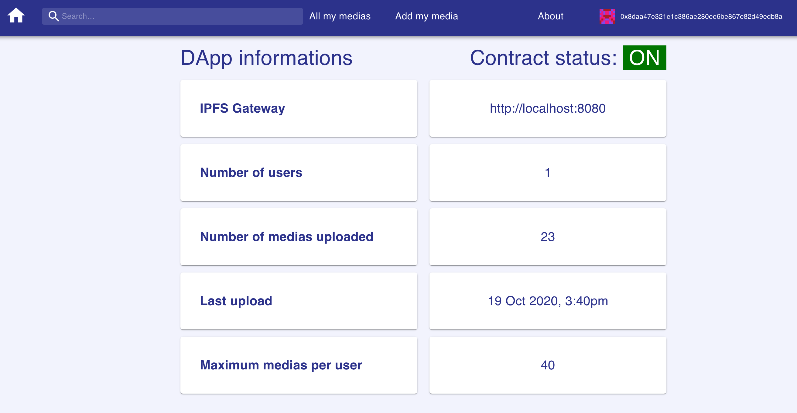

# Final Project Specifications

## Category: Proof of Existence dApp

### Description

This application allows users to prove existence of some information by showing a time stamped picture/video.

Data could be stored in a database, but to make it truly decentralized consider storing pictures using something
like [IPFS](https://www.google.com/url?q=https://ipfs.io/&sa=D&ust=1562769214900000).  
The hash of the data and any additional information is stored in a smart contract that can be referenced at a later date to verify the authenticity.

### User Stories

A user logs into the web app.

The user can upload some data (**image** or **video**) to the app, as well as add a title and a list of tags indicating the contents of the data.

The app reads the user’s address and shows all of the data that they have previously uploaded.

Users can retrieve necessary reference data about their uploaded items to allow other people to verify the data authenticity.

* Additional components included
  * Deploy the dApp to a testnet (Ropsten)
  * Include the deployed contract address so people can interact with it
  * Serve the UI from traditional web server (hosting on firebase)

---

## The DApp Gallery IPFS

[Web site](https://gallery-ipfs.web.app)


This project is an Ethereum Decentralized Application using React, React Router and Material-UI.  
This project was bootstrapped with [Create React App](https://github.com/facebook/create-react-app).

This DApp will use [Metamask](https://metamask.io/) browser addon to manage send transaction.

The DApp can uploads **image** or **video** files in IPFS network, and store the IPFS hash on the blockchain.

### Smart Contracts

* I create the `GalleryContract.sol`
* I create 2 libraries: `SafeMath8.sol` and `SafeMath256.sol`
* I import the `Ownable.sol` from OpenZeppelin
* The `Migrations.sol` already exist from truffle

### Features

#### Header


* In the header, it is possible to see the user account (retrieve by Metamask).
* It is possible to search item (i.e. "media") by an ethereum address (ex. `0xc1Fce7F895647Bd0B6638eB18b237399383676aB`),
 or by a Base58 IPFS hash (ex. `QmNdUzMmyVhVrw1FifdSjUXm7meXads1Z1tYmP5S4eqQ5D`).
* There are also 3 menu entries:
  * About
  * Add media
  * All my medias

#### About



This page is a dashboard presenting the status of the smart contract, the IPFS network used, and metrics concerning the images and videos stored in the blockchain.

If the smart contract is active, 'ON/OFF' will be update.
Number of users and IPFS hashes recorded will be updated automatically.

#### Add Media


On this page, it is possible to upload image or video files.

Title file, file and list of tags are required.

When the Upload to IPFS button is clicked, the file will be store into the Ipfs network,
and the Ipfs hash and data will be recorded in the smart contract.

Metamask will be the intermediary for the signing of the transaction.

[](https://www.youtube.com/watch?v=hxgoYYXqogQ)

#### All my medias

On this page, from the current user account, it is possible to see all images and videos uloaded and saved into the smart contract.

By clicking on the information icon, the detail page will show all saved informations about the item.

If the current user has not uloaded data, a Not Found title is display.

#### Search feature

Into the menu bar, it is possible to search image or video stored into the smart contract.

From a IPFS hash or a ethereum address, the data found will be display into the page.

* From a address, the list of IPFS hashes is display, and be clicking on the detail page will open.

If not, or if hash or address are wrong, a Not Found title is display.

[](https://youtu.be/3WVcohmqFNw)

---

### Technical details

#### Framework and libraries used

* Node JS
    * v12.18.0
    * npm 6.14.4
* IPFS
    * Locally with Docker image [ipfs/go-ipfs](https://hub.docker.com/r/ipfs/go-ipfs) and [ipfs/ipfs-cluster](https://hub.docker.com/r/ipfs/ipfs-cluster/)
    * Via [Infura](https://infura.io/docs) in production
    * ipfs-http-client
* Truffle suite
  * ganache
  * truffle
  * truffle-assertions
  * @truffle/hdwallet-provider
* Solidity
  * solc = 0.6.0
  * [solhint](https://protofire.github.io/solhint/)
* OpenZeppelin library
  * [Ownable contract](https://github.com/OpenZeppelin/openzeppelin-contracts/blob/master/contracts/access/Ownable.sol)
* web3
  * [web3](https://www.npmjs.com/package/web3) npm module v1.3.0
  * [Metamask](https://docs.metamask.io/guide/ethereum-provider.html#table-of-contents) to manager providers and accounts
* SPA web development
  * [React](https://reactjs.org/docs/getting-started.html) v16.13.1
  * [Material-UI](https://material-ui.com/) v4.11
  * [Blockies](https://www.npmjs.com/package/ethereum-blockies-base64) npm module v1.0.2

#### Installation

* Node.js
* Metamask browser extension
* Docker client if your want use IPFS network locally

_Truffle ang Ganache-CLI will be install with project npm command_

#### Available Scripts

##### IPFS

* To run IPFS into a Docker container

  * Use or create your secret: the file `.SECRET` with the secret (ex. a long word)
  * Start docker-compose with the command
```shell
./startDocker.sh
```
  * Configure the IPFS network
```shell
./setIpfsConfig.sh
```

* IPFS local endpoints
  * Gateway: http://localhost:8080/ipfs/<IPFS HASH>
  * Dashboard: localhost:5001/webui

You can use Infura gateway with your credential
* Gateway: https://ipfs.infura.io/ipfs/<IPFS HASH>

##### NPM modules installation

- Into the project root directory
```shell
npm install
```

##### Run the blockchain

- Run ganache
```shell
npm run ganache
```


- Into an other terminal, into the project root directory run truffle
```shell
npm run compile
npm run migrate
```

  

  

##### Test

I wrote 7 tests

* To check that the creation of the smart contract is effective, and that the default parameters are correct
* To check the toggle contract activation, and its well-emitted event
* To verify the saved media function, and its well-emitted event
* To verify the retrieve media saved by hash function
* To verify the retrieve medias saved by owner address function
* To verify the retrieve part of medias saved by owner address function

- Run smart contract tests
```shell
npm run test:sol
```


##### Before starting the web application

**1 - Environment variables**

* Copy the `env.example` file and rename it `.env`
* Make some updates (Infura, private key, etc.)

**2 - Truffle configuration for smart contracts migration**

* I chose to use **Ropsten** Ethereum testnet
* I chose to use a private key rather than a mnemonic, to set the HDWalletProvider

**3 - Pre-fill the smart contract with some images and videos**

* I chose to use a flag to pre-fill or not the smart contract with some images and videos
* If you want to pre-fill some data
  * Into `data` directory, the `medias.js` file contains a list of videos from the videos directory,
  and a list of image URLs.
  * The `script/saveMediasOnIpfs.js` must be run to write down the `data/ipfsMedias.json`.
  ```shell
  node script/saveMediasOnIpfs.js
  ```
  * Set the env var `PRE_FILL_DATA=true` if you want pre-fill

**4 - Deploy smart contracts into the testnet**

* Run truffle migrate on Ropsten
```
npm run migrate:ropsten
```


#### Starting the DApp

In the project directory, you can run:
```
npm start
```
Open [http://localhost:3000](http://localhost:3000) to view it in the browser.

---

### Future enhancements

- Add more feature/function smart contract tests
- Add Administration features (see all users, change maxMediasByOwner, toggle contract activation)
- Update title and tags
- Handle all smart contract errors specially during saved transaction
- Add others search features (date interval, title, tags, type of item)
